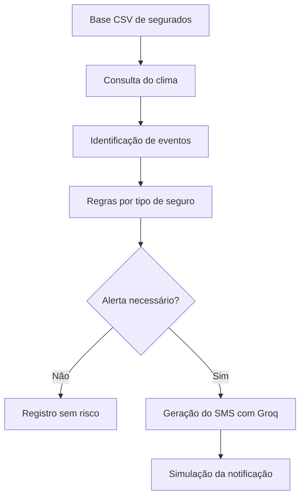

# 🛡️ ProtegeSeguro AI

Aplicação desenvolvida para o **Desafio 5 — Ferramenta Inteligente para
Comunicação Proativa com o Segurado**. O sistema consulta condições ambientais,
identifica eventos relevantes, aplica regras de negócio conforme o tipo de
seguro e utiliza um modelo de linguagem para redigir alertas preventivos.

O projeto é um MVP educacional. O envio de SMS ou notificações é apenas simulado.

---

## Funcionalidades

- **📤 Seleção da base de segurados** — Upload de arquivos CSV pela interface.
- **🌤️ Consulta meteorológica** — Temperatura, sensação térmica, umidade,
  vento, chuva e condição atual obtidos do OpenWeather.
- **🌫️ Qualidade do ar** — Consulta adicional do AQI OpenWeather para
  segurados com seguro `Saúde / Vida`.
- **⚠️ Identificação de eventos** — Chuva forte, tempestade, ventos fortes,
  calor extremo, frio intenso, baixa umidade e qualidade do ar ruim.
- **📋 Regras de negócio** — Relacionam o evento identificado ao tipo de
  seguro contratado.
- **👤 Personalização preventiva** — Considera nome, cidade, perfil, seguro e
  faixa etária, sem expor condições pessoais na mensagem.
- **🧠 Geração com IA** — Redação de SMS curtos por meio do Groq e LangChain.
- **📱 Simulação de envio** — Exibição da mensagem na interface e no terminal.
- **📊 Resumo da varredura** — Total analisado, alertas, casos sem risco e
  falhas de processamento.
- **🗂️ Visualização horizontal** — Cada resultado é apresentado em quatro
  colunas: segurado, clima, risco e mensagem.

---

## Fluxo da solução



A consulta de qualidade do ar é realizada para clientes com seguro
`Saúde / Vida` e seus resultados são incorporados antes da aplicação das regras.

---

## Estrutura do projeto

```text
.
├── app.py                         # Interface Streamlit
├── main.py                        # Execução alternativa pelo terminal
├── dataset/
│   ├── clientes.csv               # Base padrão usada pelo main.py
│   ├── clientes_centro_oeste.csv
│   ├── clientes_nordeste.csv
│   ├── clientes_norte.csv
│   ├── clientes_sudeste.csv
│   └── clientes_sul.csv
├── docs/
│   └── Relatorio_Tecnico.md       # Relatório detalhado do projeto
├── scripts/
│   └── test_openweather_api.py    # Diagnóstico manual da API
├── src/
│   ├── __init__.py
│   ├── ai_agent.py                # Prompt e geração do SMS
│   ├── air_quality_service.py     # Consulta e interpretação do AQI
│   ├── config.py                  # Caminhos e configurações gerais
│   ├── data_loader.py             # Leitura e validação do CSV
│   ├── rules_engine.py            # Regras de decisão
│   └── weather_service.py         # Consulta e análise meteorológica
├── .streamlit/
│   └── config.toml                # Tema visual do Streamlit
├── .env.example                   # Modelo das variáveis de ambiente
├── .gitignore
├── README.md
└── requirements.txt
```

[📄 Relatório técnico completo](docs/Relatorio_Tecnico.md)

---

## Instalação e execução

### Pré-requisitos

- Python 3.10 ou superior;
- chave do [OpenWeather](https://openweathermap.org/api);
- chave do [Groq](https://console.groq.com/keys).

### 1. Acesse o projeto

```bash
cd Agente_climatico
```

### 2. Crie e ative um ambiente virtual

Escolha uma das alternativas.

**Opção A — conda**

```bash
conda create -n lc_agent_env python=3.10 -y
conda activate lc_agent_env
```

**Opção B — venv**

```bash
python -m venv .venv

# Linux/macOS
source .venv/bin/activate

# Windows
.venv\Scripts\activate
```

### 3. Instale as dependências

Mesmo dentro do conda, execute o `pip` do ambiente ativado:

```bash
python -m pip install -r requirements.txt
```

### 4. Configure as variáveis de ambiente

Crie o arquivo `.env` na raiz do projeto usando `.env.example` como referência:

```dotenv
GROQ_API_KEY=sua_chave_groq
OPENWEATHER_API_KEY=sua_chave_openweather
```

O arquivo `.env` está ignorado pelo Git e não deve ser enviado ao repositório.

### 5. Execute a interface

```bash
python -m streamlit run app.py
```

Acesse `http://localhost:8501`, selecione uma base CSV e clique em
**Executar varredura**.

### 6. Execução pelo terminal

O `main.py` utiliza `dataset/clientes.csv` como base padrão:

```bash
python main.py
```

### 7. Teste da chave OpenWeather

```bash
python -m scripts.test_openweather_api
```

---

## Formato dos dados de entrada

O separador esperado é vírgula. O carregador tenta primeiro `UTF-8` com suporte
a BOM (`utf-8-sig`) e, em caso de incompatibilidade, tenta `Latin-1`.

Exemplo:

```csv
id,nome,idade,cidade,seguro,perfil,telefone
1,Cliente Exemplo,45,Belém,Auto,Usa o veículo diariamente,+5591000000000
```

### Colunas obrigatórias

- `id`;
- `nome`;
- `cidade`;
- `seguro`;
- `perfil`.

### Colunas opcionais

- `idade` — quando informada, deve ser um número inteiro entre 0 e 120;
- `telefone` — armazenado para fins de simulação, sem disparo real.

Os tipos de seguro reconhecidos pelas regras atuais são:

- `Auto`;
- `Residencial`;
- `Saúde / Vida`.

---

## Regras implementadas

### Eventos meteorológicos

| Evento | Critério utilizado no MVP |
|---|---|
| Tempestade | Código OpenWeather entre 200 e 232 |
| Chuva forte | Códigos 502, 503, 504 ou 522 |
| Ventos fortes | Velocidade superior a 40 km/h |
| Calor extremo | Temperatura ≥ 35 °C ou sensação térmica ≥ 38 °C |
| Frio intenso | Temperatura ou sensação térmica ≤ 10 °C |
| Baixa umidade | Umidade relativa ≤ 30% |
| Qualidade do ar ruim | AQI OpenWeather 4 ou 5 |

Esses limiares são parâmetros adotados para a demonstração do MVP e não
constituem alertas oficiais de defesa civil ou orientação médica.

### Relação com as apólices

| Seguro | Eventos considerados |
|---|---|
| Auto | Chuva forte, tempestade e ventos fortes |
| Residencial | Chuva forte, tempestade e ventos fortes |
| Saúde / Vida | Calor extremo, frio intenso, baixa umidade e ar ruim |

Para `Saúde / Vida`, clientes a partir de 60 anos recebem um reforço preventivo
na justificativa interna. A idade exata não deve aparecer no SMS.

---

## Exemplo de saída

```text
Cliente Exemplo, em Teresina, há alerta de calor extremo e baixa umidade.
Mantenha-se hidratado, procure ambientes frescos e reduza a exposição ao sol.
```

O texto final pode variar porque é produzido por um modelo de linguagem. O
prompt limita a resposta a duas frases e proíbe a criação de previsões,
diagnósticos, medicamentos, sintomas ou serviços não fornecidos pelo sistema.

---

## Segurança e privacidade

- as chaves são carregadas pelo `.env` e não ficam no código-fonte;
- erros HTTP não exibem a URL completa contendo a chave do OpenWeather;
- textos externos são escapados antes de serem inseridos no HTML da interface;
- o CSV é validado antes da varredura;
- o prompt orienta o modelo a não mencionar doenças ou condições pessoais;
- a aplicação não envia mensagens reais nem persiste os resultados.

Em uma implantação real, seriam necessários autenticação, autorização,
criptografia, auditoria, política de retenção e avaliação de conformidade com a
LGPD.

---

## Tecnologias

- [Python](https://www.python.org/);
- [Streamlit](https://streamlit.io/);
- [OpenWeather](https://openweathermap.org/api);
- [Groq](https://groq.com/);
- [LangChain](https://www.langchain.com/);
- [Requests](https://requests.readthedocs.io/);
- [python-dotenv](https://pypi.org/project/python-dotenv/).

---

## Limitações atuais

- utiliza observações atuais, e não previsão meteorológica ou alerta oficial;
- consulta as cidades informadas no CSV, sem geolocalização individual;
- não realiza disparo efetivo de SMS ou push;
- não possui banco de dados ou histórico de alertas;
- depende da disponibilidade e dos limites das APIs externas;
- mensagens generativas podem apresentar pequenas variações;
- ainda não existe uma suíte automatizada completa de testes.

---

## Uso de inteligência artificial no desenvolvimento

O desenvolvimento do código e da documentação contou com apoio de ferramentas
baseadas em modelos de linguagem para revisão, depuração, organização dos
módulos e aprimoramento dos prompts. As decisões de arquitetura, regras de
negócio e validação do funcionamento foram revisadas durante o desenvolvimento.

O modelo usado pela aplicação é configurado em `src/config.py` e acessado pela
API do Groq.

