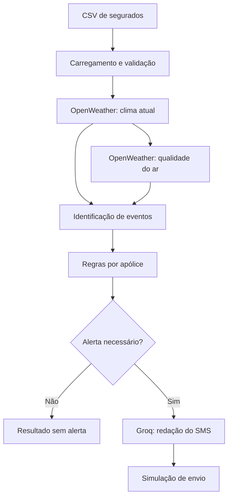
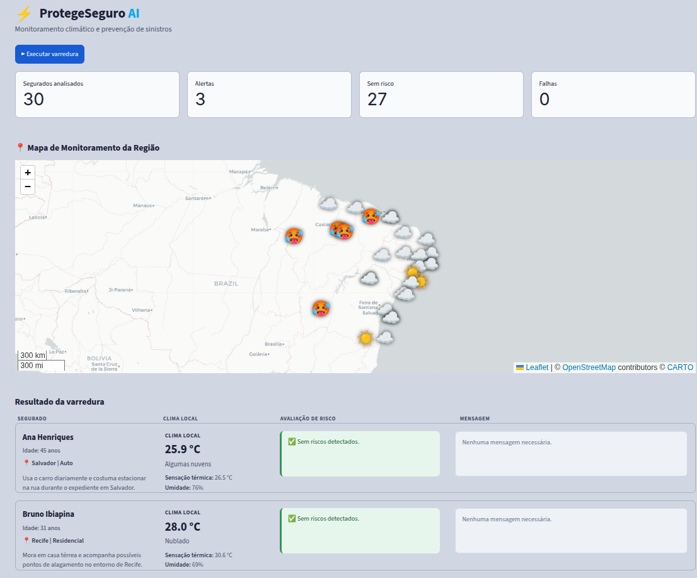
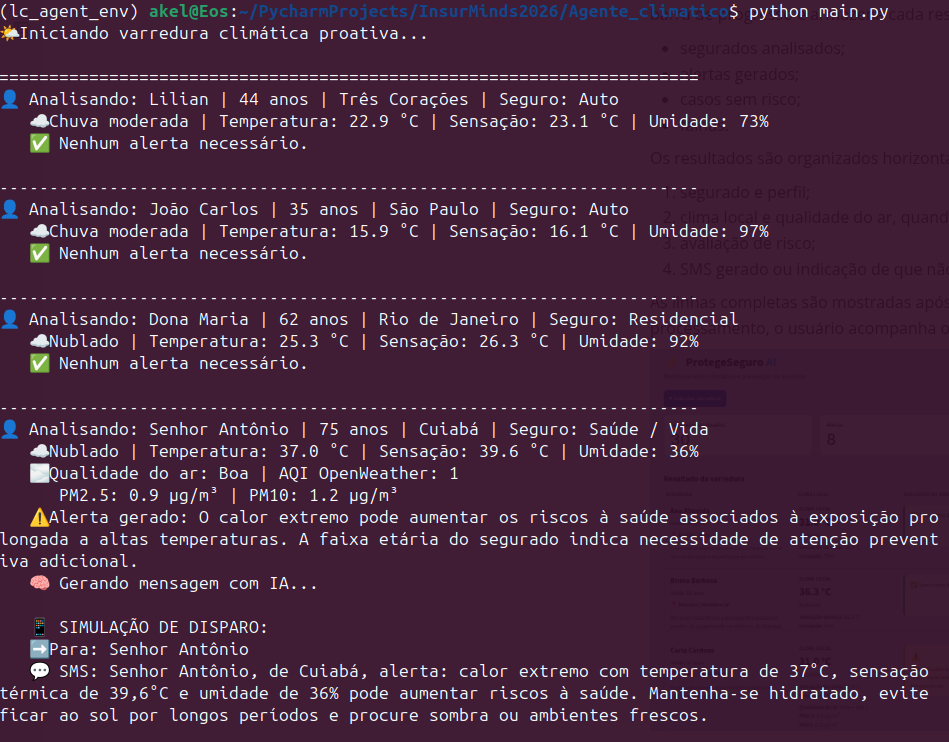

# Relatório Técnico

## ProtegeSeguro AI — Comunicação Proativa com o Segurado

## 1. Introdução

### 1.1 Contexto da atividade

O projeto foi desenvolvido para o **Desafio 5: Ferramenta Inteligente para Comunicação Proativa com o Segurado***. A atividade propõe a construção de um protótipo capaz de observar eventos externos, avaliar possíveis impactos sobre diferentes perfis de  segurados e gerar comunicações preventivas antes da ocorrência de um sinistro.

Grande parte do relacionamento tradicional entre seguradora e cliente ocorre depois
de um evento danoso. O Protege Seguro AI demonstra uma alternativa proativa: o
sistema consulta condições ambientais atuais, identifica eventos relevantes, combina esses eventos com regras relacionadas à apólice e produz um SMS preventivo quando existe correspondência entre risco e seguro contratado.

O protótipo utiliza dados meteorológicos e de qualidade do ar do OpenWeather,regras
determinísticas implementadas em Python e uma etapa generativa baseada em Groq e
LangChain. A interface gráfica foi construída utilizando o framework Streamlit,devido à
sua simplicidade e à agilidade que proporciona na construção e validação de protótipos.

### 1.2 Objetivo do projeto

O objetivo principal é demonstrar o fluxo completo de comunicação preventiva
solicitado pelo desafio:

1. carregar uma base simulada de segurados;
2. consultar uma fonte externa de dados ambientais;
3. identificar eventos relevantes;
4. aplicar regras de negócio por tipo de seguro;
5. gerar mensagens personalizadas com um modelo de linguagem;
6. simular o envio das notificações;
7. apresentar os resultados de maneira clara na interface.

### 1.3 Escopo da solução

A solução possui caráter educacional e foi construída como MVP. Ela não realiza
integração com sistemas reais de seguradoras, não consulta dados contratuais
reais, não envia SMS e não pretende substituir alertas de órgãos oficiais.

A base usada na demonstração é sintética. O protótipo cobre três categorias de
seguro:

- Auto;
- Residencial;
- Saúde / Vida.

O escopo inicial do desafio foi ampliado com temperatura aparente, umidade,
faixa etária e qualidade do ar. Essas extensões permanecem integradas ao mesmo
fluxo. A arquitetura multiagente é apresentada nas instruções como uma sugestão,
mas não é obrigatória; por isso, o MVP mantém uma única etapa generativa e
componentes Python especializados para as demais responsabilidades.

---

## 2. Tecnologias e arquitetura da solução

### 2.1 Tecnologias utilizadas

| Tecnologia                  | Finalidade                                   |
| --------------------------- | -------------------------------------------- |
| Python                      | Linguagem principal da aplicação             |
| Streamlit                   | Interface web e controle de estado           |
| Requests                    | Requisições HTTP às APIs externas            |
| OpenWeather Current Weather | Condições meteorológicas atuais              |
| OpenWeather Air Pollution   | Índice e componentes de qualidade do ar      |
| LangChain Core              | Construção e encadeamento do prompt          |
| LangChain Groq              | Integração com o modelo hospedado no Groq    |
| python-dotenv               | Carregamento local das variáveis de ambiente |
| CSV da biblioteca padrão    | Leitura da base de segurados                 |
| Folium | Construção do mapa climático interativo |
| streamlit-folium | Incorporação do mapa Folium na interface Streamlit |
| CARTO Basemaps | Fornecimento da camada cartográfica Dark Matter |

O modelo configurado na versão analisada é:

```text
openai/gpt-oss-20b
```

A temperatura do modelo está definida como `0.2`, buscando reduzir variações
sem eliminar completamente a flexibilidade de redação.

### 2.2 Estrutura do projeto

```text
.
├── app.py
├── main.py
├── dataset/
│   ├── clientes.csv
│   ├── clientes_centro_oeste.csv
│   ├── clientes_nordeste.csv
│   ├── clientes_norte.csv
│   ├── clientes_sudeste.csv
│   └── clientes_sul.csv
├── docs/
│   ├── Relatorio_Tecnico.pdf
│   └── Relatorio_Tecnico.md
├── scripts/
│   ├── __init__.py
│   ├── run_tests.py
│   ├── test_data_loader.py
│   ├── test_event_detection.py
│   ├── test_groq_api.py
│   ├── test_openweather_api.py
│   ├── test_rules_engine.py
│   └── test_services_mock.py
├── src/
│   ├── __init__.py
│   ├── ai_agent.py
│   ├── air_quality_service.py
│   ├── config.py
│   ├── data_loader.py
│   ├── rules_engine.py
│   └── weather_service.py
├── .streamlit/
│   └── config.toml
├── .env.example
├── .gitignore
├── README.md
└── requirements.txt
```

Essa organização mantém os pontos de entrada na raiz e concentra as rotinas da
aplicação em `src`. Dados, documentação, scripts auxiliares e configuração
visual ficam em diretórios próprios.

### 2.3 Responsabilidades dos módulos

### `app.py`

Concentra a interface principal do sistema. Permite selecionar a base CSV,
executar a varredura, acompanhar o processamento e consultar o resumo dos
resultados.

Após a análise, apresenta um mapa climático com a distribuição geográfica dos
segurados processados. Também organiza os resultados individuais em quatro
colunas: segurado, clima local, avaliação de risco e mensagem preventiva.

### `main.py`

Executa o mesmo fluxo principal no terminal, usando
`dataset/clientes.csv` como base padrão. Essa alternativa facilita a
demonstração e o diagnóstico sem a interface web.

### `src/config.py`

Centraliza:

- caminho da raiz e do diretório de dados;
- carregamento do `.env`;
- nomes das chaves necessárias;
- URLs do OpenWeather;
- timeout das requisições;
- modelo, temperatura e tentativas do Groq.

As credenciais não são escritas nesse arquivo. Ele apenas lê as variáveis do
ambiente.

### `src/data_loader.py`

Lê o CSV enviado pelo Streamlit ou informado por caminho, trata duas
codificações, valida as colunas obrigatórias e converte a idade quando presente.

### `src/weather_service.py`

Consulta o clima atual, extrai as variáveis relevantes e identifica eventos
meteorológicos com critérios explícitos.

### `src/air_quality_service.py`

Consulta a qualidade do ar por latitude e longitude, interpreta o AQI do
OpenWeather e disponibiliza concentrações de componentes para exibição.

### `src/rules_engine.py`

Relaciona os eventos detectados ao tipo de seguro. Por ser determinístico, esse
módulo permite explicar por que um alerta foi ou não produzido.

### `src/ai_agent.py`

Constrói o prompt, organiza o contexto do segurado e solicita ao modelo uma
mensagem curta. Apesar do nome do módulo, não se trata de uma arquitetura
multiagente: existe uma única etapa generativa, precedida por coleta e decisão
determinísticas.

### `scripts/test_openweather_api.py`

Realiza um diagnóstico manual da chave e da resposta da API meteorológica.

### 2.4 Especialização das responsabilidades

As instruções sugerem, de forma opcional, agentes especializados para coleta,
análise, decisão e geração. No projeto, essa especialização foi implementada no
nível dos componentes de software:

| Responsabilidade sugerida         | Componente implementado  |
| --------------------------------- | ------------------------ |
| Obtenção dos dados meteorológicos | `weather_service.py`     |
| Obtenção da qualidade do ar       | `air_quality_service.py` |
| Análise dos eventos               | `identificar_eventos()`  |
| Aplicação das regras              | `rules_engine.py`        |
| Geração da comunicação            | `ai_agent.py`            |

Somente a última etapa utiliza um modelo de linguagem. As etapas anteriores são
determinísticas, o que favorece explicabilidade, custo menor e testes mais
simples. Essa opção atende ao fluxo solicitado sem afirmar a existência de uma
arquitetura multiagente que não foi implementada.

### 2.5 Arquitetura geral



A qualidade do ar é consultada apenas para apólices `Saúde / Vida`. Nos outros
tipos, o sistema segue diretamente da consulta meteorológica para as regras.

A interface principal também apresenta uma visualização cartográfica dos
resultados. O mapa reutiliza as coordenadas de latitude e longitude retornadas
pelo OpenWeather durante a consulta meteorológica, sem realizar uma nova etapa
de geocodificação.

Após a varredura, os resultados válidos são percorridos e adicionados a um mapa
único. O enquadramento é ajustado automaticamente para abranger as localidades
presentes na base selecionada. Essa visualização ocorre somente na camada de
apresentação e não interfere na identificação dos eventos, nas regras de negócio
ou na geração das mensagens.

---

# 3. Entrada e preparação dos dados

### 3.1 Base de segurados

A aplicação recebe um CSV pela barra lateral do Streamlit. O `main.py` utiliza
uma base padrão no diretório `dataset`.

O conjunto sintético foi dividido em cinco arquivos regionais, cada um com 30
registros e cidades pertencentes à respectiva região brasileira:

- `clientes_norte.csv`;
- `clientes_nordeste.csv`;
- `clientes_centro_oeste.csv`;
- `clientes_sudeste.csv`;
- `clientes_sul.csv`.

As capitais recebem presença maior, mas também há outras cidades, permitindo
demonstrar o comportamento do sistema em contextos climáticos variados.

### 3.2 Esquema esperado

As bases sintéticas foram geradas por meio de prompts direcionados a modelos de linguagem (LLMs), instruídos a produzir dados em formato CSV atendendo ao esquema do projeto. O formato completo gerado para as bases é:O formato completo utilizado nas bases sintéticas é:

```text
id,nome,idade,cidade,seguro,perfil,telefone
```

As colunas obrigatórias no código são:

```text
id
nome
cidade
seguro
perfil
```

`idade` e `telefone` são opcionais. Quando a idade é informada, deve ser um
inteiro entre 0 e 120. O telefone é mantido apenas como dado de simulação; o
programa não realiza disparo real.

### 3.3 Compatibilidade de codificação

O carregador lê o arquivo como bytes e tenta primeiro `utf-8-sig`. Essa opção
aceita UTF-8 comum e também arquivos com BOM, frequentes em exportações de
planilhas. Se ocorrer erro de decodificação, o sistema tenta `Latin-1`.

Essa estratégia foi adotada para evitar problemas como a exibição incorreta de
nomes e cidades com acentos.

### 3.4 Validação

Antes da varredura, o carregador verifica:

- presença das colunas obrigatórias;
- conversão da idade;
- intervalo permitido para a idade;
- leitura válida em uma das codificações suportadas.

Na interface, erros de estrutura ou codificação interrompem o processamento e
são apresentados ao usuário.

---

## 4. Coleta e interpretação de dados externos

### 4.1 Clima atual

Para cada cidade, `weather_service.py` consulta o endpoint de clima atual do
OpenWeather usando:

```text
q=<cidade>,BR
units=metric
lang=pt_br
```

São extraídos:

- nome retornado para a cidade;
- latitude e longitude;
- temperatura;
- sensação térmica;
- umidade relativa;
- velocidade do vento, convertida de m/s para km/h;
- volume de chuva na última hora, quando fornecido;
- código, condição geral e descrição do tempo.

Latitude e longitude são usadas posteriormente na consulta da qualidade do ar.

### 4.2 Qualidade do ar

Para segurados com seguro `Saúde / Vida`, o sistema consulta o endpoint de
poluição do ar usando as coordenadas obtidas na etapa anterior.

O OpenWeather fornece uma escala de AQI de 1 a 5:

| AQI | Classificação usada pela aplicação |
| ---:| ---------------------------------- |
| 1   | Boa                                |
| 2   | Razoável                           |
| 3   | Moderada                           |
| 4   | Ruim                               |
| 5   | Muito ruim                         |

Também são extraídos PM2.5, PM10, ozônio, dióxido de nitrogênio, dióxido de
enxofre, monóxido de carbono, monóxido de nitrogênio e amônia. No MVP, a decisão
de alerta utiliza a classificação do AQI; os componentes são informativos e
podem ser exibidos na interface.

### 4.3 Tratamento de falhas externas

Os serviços tratam:

- timeout;
- falha de conexão;
- chave recusada (`HTTP 401`);
- cidade não encontrada (`HTTP 404`, no clima);
- limite de chamadas excedido (`HTTP 429`);
- outras respostas HTTP sem sucesso;
- JSON inválido ou dados incompletos.

As exceções de conexão não imprimem a URL completa, reduzindo o risco de expor
a chave presente nos parâmetros da requisição.

---

## 5. Identificação de eventos e regras de negócio

### 5.1 Eventos meteorológicos

O serviço meteorológico pode identificar vários eventos simultaneamente.

| Evento        | Critério implementado                   |
| ------------- | --------------------------------------- |
| Tempestade    | Código OpenWeather entre 200 e 232      |
| Chuva forte   | Código 502, 503, 504 ou 522             |
| Ventos fortes | Vento superior a 40 km/h                |
| Calor extremo | Temperatura ≥ 35 °C ou sensação ≥ 38 °C |
| Frio intenso  | Temperatura ou sensação ≤ 10 °C         |
| Baixa umidade | Umidade relativa ≤ 30%                  |

O evento de qualidade do ar ruim é acrescentado quando o AQI OpenWeather é 4
ou 5.

Esses valores são limiares definidos para o protótipo. Eles não representam,
por si só, um aviso oficial ou recomendação médica.

### 5.2 Regras por tipo de seguro

Os eventos são comparados com um dicionário de regras.

| Tipo de seguro | Eventos que podem gerar alerta                       |
| -------------- | ---------------------------------------------------- |
| Auto           | Chuva forte, tempestade e ventos fortes              |
| Residencial    | Chuva forte, tempestade e ventos fortes              |
| Saúde / Vida   | Calor extremo, frio intenso, baixa umidade e ar ruim |

Um mesmo conjunto climático pode, portanto, gerar alertas diferentes para
clientes localizados na mesma cidade. A decisão depende da compatibilidade entre
evento e apólice.

### 5.3 Uso da faixa etária

Para seguro `Saúde / Vida`, idade igual ou superior a 60 anos adiciona ao motivo
uma indicação de atenção preventiva. A idade não cria sozinha um evento e não
altera as regras de outras apólices.

Essa informação é usada pelo modelo apenas para ajustar o tom. O prompt proíbe
mencionar a idade exata e condições de saúde específicas.

### 5.4 Separação entre decisão e geração

A decisão de enviar um alerta é inteiramente determinística:

```text
eventos detectados + tipo de seguro + faixa etária → decisão e motivo
```

O modelo de linguagem não decide quem recebe notificação. Ele somente redige a
mensagem depois que `rules_engine.py` retorna uma decisão positiva. Essa
separação reduz o risco de decisões inconsistentes ou não explicáveis.

---

## 6. Componente de inteligência artificial

### 6.1 Integração escolhida

O módulo `ai_agent.py` utiliza `ChatPromptTemplate` e `ChatGroq`. O fluxo é uma
cadeia simples:

```text
prompt estruturado → modelo Groq → conteúdo textual do SMS
```

Não existe execução de ferramentas pelo modelo, planejamento autônomo ou
coordenação de múltiplos agentes. A inteligência generativa é aplicada somente
à comunicação final.

### 6.2 Contexto fornecido ao modelo

O prompt recebe:

- nome e cidade;
- tipo de seguro;
- perfil sintético;
- idade ou indicação de ausência;
- descrição do clima;
- temperatura, sensação térmica e umidade;
- classificação da qualidade do ar, quando consultada;
- motivo produzido pelo motor de regras.

### 6.3 Restrições do prompt

O prompt estabelece que a resposta deve:

- possuir exatamente duas frases;
- ser empática e direta;
- apresentar o risco na primeira frase;
- oferecer uma ou duas medidas preventivas na segunda;
- utilizar somente os fatos recebidos;
- não inventar previsões, horários ou serviços;
- não mencionar diagnósticos, doenças ou medicamentos;
- não criar sintomas ou consequências médicas;
- não mencionar qualidade do ar quando ela não fizer parte do motivo;
- retornar apenas o SMS, sem título, aspas ou explicações.

Para alertas de qualidade do ar, as instruções limitam os dados à cidade,
classificação e AQI, e as recomendações à redução de permanência ao ar livre e
de atividades externas prolongadas.

### 6.4 Personalização controlada

A personalização utiliza informações do cliente para adequar linguagem e
orientação ao contexto da apólice. O perfil não autoriza a exposição de dados
pessoais na mensagem. Essa distinção foi reforçada no prompt após testes em que
o modelo produziu orientações excessivamente específicas.

---

## 7. Interface e simulação das notificações

### 7.1 Interface Streamlit

O usuário seleciona o CSV na barra lateral. A aplicação apresenta a quantidade
de segurados ativos e uma tabela resumida com nome, cidade e seguro.

Ao pressionar **Executar varredura**, o sistema percorre os clientes, atualiza a
barra de progresso e armazena cada resultado. Depois da conclusão, apresenta:

- segurados analisados;
- alertas gerados;
- casos sem risco;
- falhas.

Os resultados são organizados horizontalmente em quatro colunas:

1. segurado e perfil;
2. clima local e qualidade do ar, quando consultada;
3. avaliação de risco;
4. mapa da região 
5. SMS gerado ou indicação de que não há mensagem.

As linhas completas são mostradas após o término da varredura. Durante o
processamento, o usuário acompanha o cliente atual e a progressão numérica.

Após o resumo da varredura, o `app.py` apresenta um mapa de monitoramento. Para
cada resultado que contém dados climáticos válidos, é criado um marcador na
latitude e longitude retornadas pelo OpenWeather.

Os marcadores utilizam emojis definidos a partir da temperatura e da condição
meteorológica geral. A implementação representa calor intenso, frio intenso,
chuva ou tempestade, céu limpo e condições de nebulosidade.

O mapa apresenta informações resumidas por meio de tooltip e popup, incluindo
nome do segurado, cidade, temperatura e condição observada. O enquadramento é
ajustado automaticamente para incluir as coordenadas da base analisada



Figura 2: Screnshoot da applicação em streamlit
### 7.2 Cache e estado da sessão

As consultas meteorológicas e de qualidade do ar utilizam cache de dez minutos.
Isso evita repetir chamadas para a mesma cidade ou coordenada em execuções
próximas.

Os resultados são armazenados no `session_state`. Quando o usuário seleciona
outro arquivo, os resultados anteriores são removidos para evitar mistura entre
bases diferentes.

### 7.3 Execução no terminal

O `main.py` demonstra o mesmo fluxo em modo textual. Para cada cliente, exibe:

- identificação e idade;
- clima atual;
- qualidade do ar, quando aplicável;
- motivo da decisão;
- mensagem simulada.


### 7.4 Exemplos de mensagens

Os exemplos a seguir representam o formato esperado. O texto exato pode variar
entre execuções.

**Calor extremo e baixa umidade**

> Sofia, em Teresina, há alerta de calor extremo e baixa umidade. Mantenha-se
> hidratada, procure ambientes frescos e reduza a exposição ao sol.

**Qualidade do ar ruim**

> Cliente Teste, em Belém, a qualidade do ar está classificada como ruim (AQI
> 4). Reduza a permanência ao ar livre e evite atividades externas prolongadas.

**Chuva e seguro Auto**

> João Carlos, em São Paulo, há risco relacionado à chuva forte. Redobre a
> atenção no trânsito e evite áreas com possibilidade de alagamento.

Esses textos são exemplos documentais e não resultados fixos no código.

---

## 8. Validação e testes

### 8.1 Validações realizadas durante o desenvolvimento

Foram executados testes manuais para verificar:

- carregamento da chave do OpenWeather;
- resposta `HTTP 200` para cidades brasileiras;
- extração de temperatura e coordenadas;
- consulta de qualidade do ar por latitude e longitude;
- classificação dos valores de AQI;
- geração de alertas simulados para AQI 4 e 5;
- inclusão de sensação térmica e umidade;
- aplicação do reforço preventivo por faixa etária;
- importação do módulo Groq;
- execução completa pelo terminal;
- execução completa pela interface Streamlit;
- leitura de arquivos `utf-8-sig` e `Latin-1`;
- leitura das cinco bases regionais com 30 registros cada.

### 8.2 Cenário de calor e baixa umidade

Um teste real da integração retornou para Teresina temperatura de 37,8 °C,
sensação de 36,9 °C e umidade de 22%. O serviço identificou simultaneamente
`Calor Extremo` e `Baixa Umidade`. Para uma apólice `Saúde / Vida`, o motor de
regras gerou um alerta e acrescentou atenção preventiva pela faixa etária.

Esse teste demonstrou que:

- múltiplos eventos podem ser preservados;
- os motivos são combinados;
- a sensação térmica não precisa ser maior que a temperatura para o calor ser
  reconhecido;
- a baixa umidade é avaliada independentemente;
- a mensagem pode sintetizar mais de um risco em duas frases.

### 8.3 Cenários de qualidade do ar

Foram simulados AQI 4 e 5. Em ambos os casos:

- o serviço classificou o ar como ruim ou muito ruim;
- `evento_relevante` foi definido como `Qualidade do Ar Ruim`;
- o motor de regras enviou o evento para apólices `Saúde / Vida`;
- o prompt restringiu as recomendações a reduzir exposição externa.

Os testes ajudaram a retirar sugestões não sustentadas pelos dados, como
medicamentos, equipamentos ou serviços inexistentes.

### 8.4 Tratamento de erros observado

Durante o desenvolvimento foram diagnosticados e corrigidos:

- chave OpenWeather inválida (`HTTP 401`);
- serviço local do Ollama indisponível;
- dependência `langchain_groq` ausente no interpretador usado pelo Streamlit;
- execução do Streamlit fora do ambiente conda correto;
- referência antiga a `API_KEY` após centralização das configurações;
- caracteres acentuados lidos com codificação incorreta;
- recomendações excessivamente específicas produzidas pelo modelo.

A versão final adotou somente Groq para a geração, eliminando a dependência do
Ollama e do modelo local.

---

## 9. Boas práticas, segurança e limitações

### 9.1 Organização modular

A separação entre coleta, interpretação, decisão, comunicação e interface está
alinhada às boas práticas recomendadas pelo desafio. Alterações em um endpoint,
regra ou prompt podem ser realizadas sem concentrar toda a lógica no `app.py`.

### 9.2 Proteção das credenciais

As chaves esperadas são:

```text
GROQ_API_KEY
OPENWEATHER_API_KEY
CARTO_BASEMAPS_API_KEY
```

Elas são carregadas do `.env`, que está incluído no `.gitignore`. O repositório
deve conter somente `.env.example`, sem valores reais.

### 9.3 Proteção da interface

Dados do CSV, respostas externas e mensagens da IA são escapados com
`html.escape` antes da inserção em trechos HTML da interface. Essa medida reduz
o risco de interpretação indevida de conteúdo como marcação.

### 9.4 Privacidade

As bases do MVP são sintéticas. Em uso real, perfis, idade, localização e
telefone exigiriam controles adicionais, incluindo:

- finalidade e base legal definidas;
- minimização dos dados;
- controle de acesso;
- criptografia;
- retenção limitada;
- registro de auditoria;
- avaliação dos provedores externos;
- atendimento aos direitos previstos na LGPD.

### 9.5 Limitações

**Observação atual, não previsão**

O endpoint utilizado representa o momento da consulta. O sistema não prevê a
evolução do evento e não substitui avisos meteorológicos oficiais.

**Localização por cidade**

O clima associado ao segurado corresponde à cidade informada, sem endereço ou
coordenada individual.

**Escopo das regras**

Os limiares e associações foram definidos para demonstrar o fluxo do MVP. Uma
solução de produção exigiria validação atuarial, meteorológica, médica e
regulatória.

**Dependência de serviços externos**

Indisponibilidade, mudanças de contrato, latência ou limites do OpenWeather e do
Groq podem afetar o processamento.

**Variação generativa**

Mesmo com temperatura baixa, o modelo pode variar a redação. O motor de regras
reduz essa variabilidade na decisão, mas não elimina a necessidade de avaliar o
texto gerado.

**Dependência do provedor cartográfico**

A apresentação do mapa depende da disponibilidade do CARTO Basemaps e de uma
chave válida. Uma eventual falha no carregamento da camada cartográfica não
modifica os dados meteorológicos já coletados nem as decisões produzidas pelo
motor de regras.

**Ausência de envio e persistência**

Não há integração real com SMS, push ou e-mail. Os resultados não são gravados
em banco de dados.


## 10. Uso de ferramentas de inteligência artificial no desenvolvimento

Ferramentas baseadas em modelos de linguagem foram utilizadas como apoio ao
desenvolvimento, especialmente em:

- revisão e reorganização do código;
- diagnóstico de erros de integração e ambiente;
- aprimoramento das instruções do prompt;
- criação de cenários de teste;
- revisão textual e estruturação da documentação.

O uso foi assistivo. As decisões sobre arquitetura, regras, escopo, dados e
validação foram revistas ao longo do desenvolvimento. Este relatório também foi
elaborado com apoio de um modelo de linguagem e conferido em relação ao código
disponibilizado.

---

## 11. Conclusão

O ProtegeSeguro AI demonstra de forma funcional a passagem de um modelo reativo
para uma abordagem preventiva de comunicação com segurados. A solução integra
uma base sintética, dados atuais de uma fonte pública, identificação de eventos,
regras explicáveis e geração controlada de mensagens.

O mapa climático amplia a apresentação dos resultados ao permitir observar a
distribuição geográfica dos segurados e das condições meteorológicas
analisadas. Essa funcionalidade está integrada à interface principal e atua
somente como recurso de visualização, preservando o fluxo de decisão já
implementado.

O aspecto central da arquitetura é a separação entre decisão e redação. O motor
de regras determina se existe relação entre o evento e a apólice; o modelo de
linguagem atua somente depois dessa decisão, transformando um motivo já definido
em um SMS curto. Isso mantém a lógica essencial verificável e utiliza a IA
generativa onde ela agrega maior valor: clareza e personalização da comunicação.

A validação funcional do projeto confirmou a execução do fluxo ponta a ponta no 
terminal e na interface gráfica. Com a estrutura modular consolidada, chaves protegidas, 
repositório integralmente sincronizado e o artefato de entrega verificado, o projeto atende com precisão a todos os critérios estabelecidos pelo desafio.

---

### Referências técnicas

- OpenWeather — Current Weather Data: <https://openweathermap.org/current>
- OpenWeather — Air Pollution API: <https://openweathermap.org/api/air-pollution>
- Groq — Documentação: <https://console.groq.com/docs>
- Streamlit — Documentação: <https://docs.streamlit.io/>
- LangChain — Documentação: <https://python.langchain.com/docs/>
